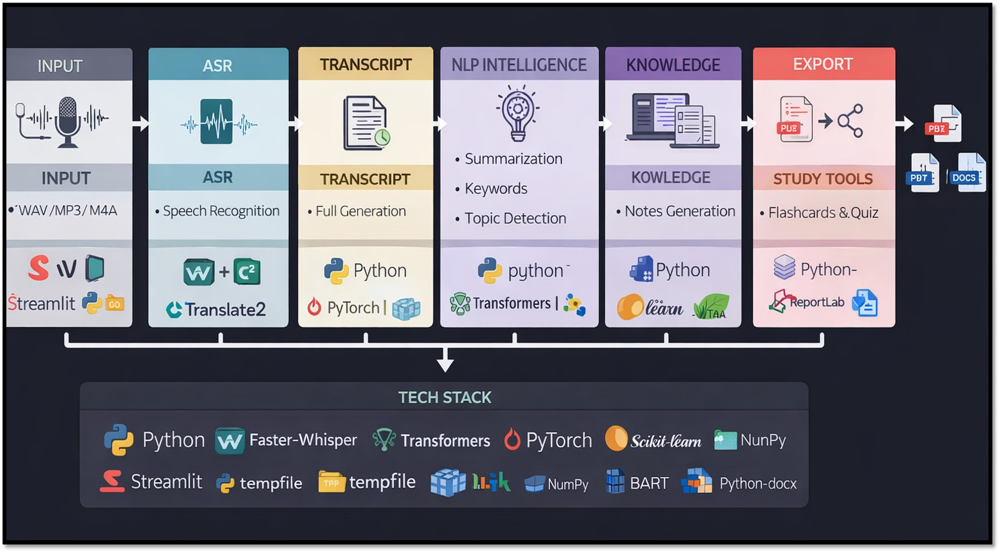

# 🎙 Lecture Voice-to-Notes Generator  
### AI-Powered Lecture Transcription & Intelligent Structured Notes System

---

## 🧠 System Architecture

---

## 🚀 Overview

The **Lecture Voice-to-Notes Generator** is an end-to-end AI system that converts lecture audio into structured, study-ready notes using Automatic Speech Recognition (ASR) and Natural Language Processing (NLP).

This project demonstrates practical implementation of:

- 🎙 Speech-to-Text using Faster-Whisper
- 🧠 Transformer-based summarization (T5/BART)
- 🔎 Keyword extraction (TF-IDF)
- 📊 Sentence embeddings (MiniLM)
- 🧩 Unsupervised topic clustering (KMeans)
- 📝 Structured note generation
- 📤 Export to PDF / DOCX

Designed as an **AIML project**, this system showcases real-world ML pipeline engineering, debugging, and deployment thinking.

---

## 🔄 Processing Pipeline

### 1️⃣ Input Layer
- WAV / MP3 / M4A audio upload
- Streamlit interface

### 2️⃣ ASR Layer
- Faster-Whisper (CTranslate2 backend)
- Speech-to-text conversion
- Timestamped segments

### 3️⃣ Transcript Layer
- Full transcript generation
- Text cleaning & preprocessing
- Sentence segmentation

### 4️⃣ NLP Intelligence
- Summarization (T5/BART)
- Keyword extraction (TF-IDF)
- Topic detection (KMeans clustering)
- Sentence embeddings (MiniLM)
- Important sentence ranking

### 5️⃣ Knowledge Layer
- Structured notes generation
- Concept grouping
- Definition extraction

### 6️⃣ Export & Study Tools
- PDF export
- DOCX export
- Flashcards & quiz generation (planned)

---

## 🛠 Tech Stack

### Core
- Python
- Streamlit

### Speech Recognition
- faster-whisper
- CTranslate2
- FFmpeg

### NLP & ML
- Transformers (T5 / BART)
- Sentence-Transformers (MiniLM)
- Scikit-learn
- NumPy
- Regex-based preprocessing

### Export
- ReportLab
- python-docx

